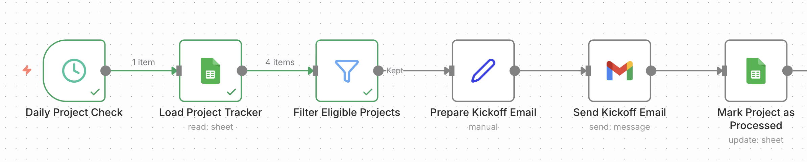

# Customer Project Kickoff Automation

An n8n workflow that checks a project tracker for projects that are ready for kickoff, sends a prepared email to the customer contact, and updates the tracker to prevent duplicate sends.

**Stack:** n8n · Google Sheets · Gmail · Google OAuth

I built this project around a recurring preparation step in customer onboarding and SaaS implementation.



## The Problem

Customer project kickoffs often involve the same preparation steps.

Someone needs to check whether the project is ready, send the customer the relevant information, ask them to review the project plan, and keep track of whether the kickoff email has already been sent.

These steps are simple, but they can be forgotten, repeated, or handled inconsistently.

This workflow automates that preparation step.

## The Workflow

1. A schedule starts the workflow.
2. The workflow reads the project tracker from Google Sheets.
3. It filters for projects that are ready for kickoff and have not received the kickoff email yet.
4. It prepares a personalized kickoff email.
5. Gmail sends the email to the customer contact.
6. The workflow updates the tracker with the email status and timestamps.

Once a project has been processed, it is skipped in future runs.

## Design Decisions

**Use project status to control eligibility.**  
The workflow only continues when both conditions are true:

```text
Status contains "Kickoff Ready"
AND
Kickoff Email Sent is false
